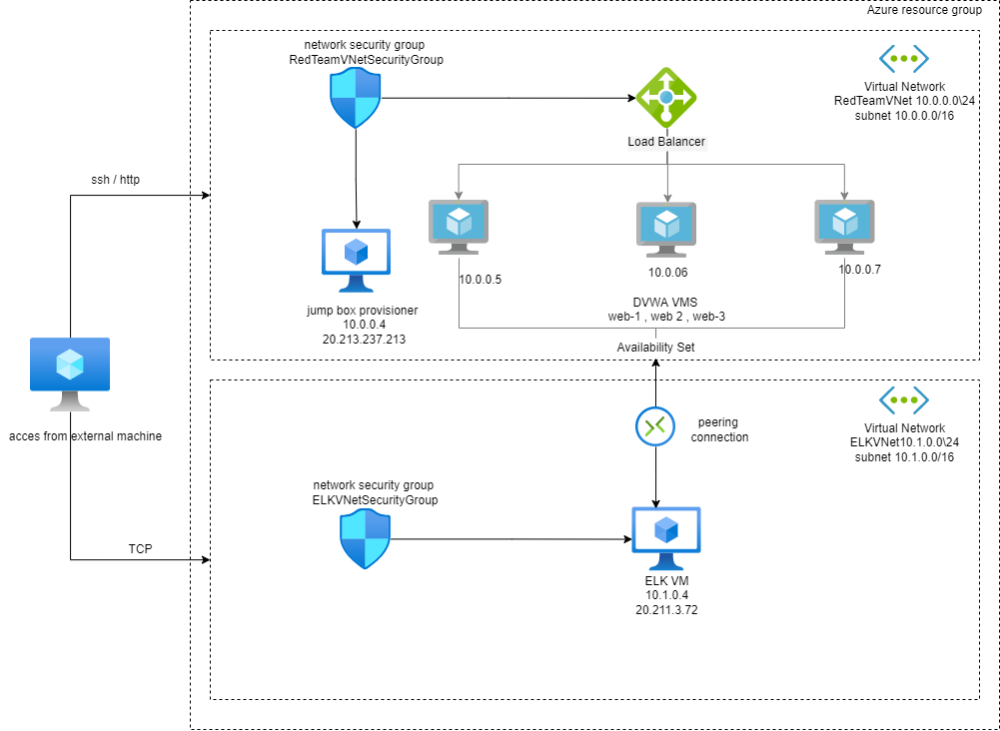
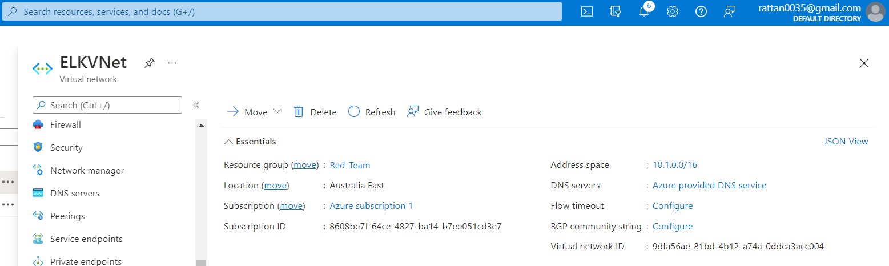
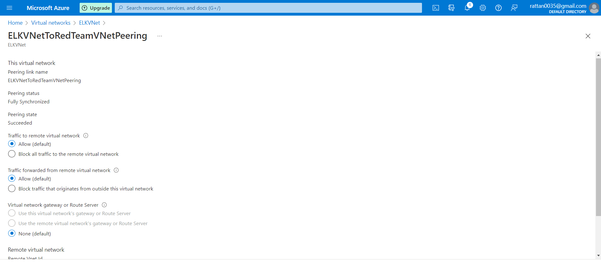

# ELK-Stack-Project

**Automated ELK Stack Deployment**

This repository's files were used to set up the network shown below.



These files have been tested and used to create an ELK Stack Deployment on Azure that is fully automated. They can either be utilised to re-create the whole deployment shown below. Otherwise, chosen elements of the YAML files, such as Filebeat and Metricbeat, can be utilised to install only specific parts of it.

- [elk.yml](./Ansible/elk.yml)
- [filebeat-config.yml](./Ansible/filebeat-config.yml)
- [filebeat-playbook.yml](./Ansible/filebeat-playbook.yml)
- [metricbeat-config.yml](./Ansible/metricbeat-config.yml)
- [metricbeat-playbook.yml](./Ansible/metricbeat-playbook.yml)

The following information is included in this document: 

- Description of the Topology
- Access Policies
- ELK Configuration
- Beats in Use
- Machines Being Monitored
- How to Use the Ansible Build

### Description of the Topology

The primary goal of this network is to offer a load-balanced and monitored instance of the D\*mn Vulnerable Web Application, or DVWA. 

In addition to limiting inbound network access, load balancing ensures that the application is highly available. 


> What aspect of security do load balancers protect?

- The fundamental objective of the load balancer, according to the [Azure security baseline for Azure Load Balancer](https://bit.ly/3AnSRPV), is to distribute web traffic across numerous servers. To safeguard Azure resources within virtual networks, a load balancer was built in front of the VM on our network. 
- Keep track of virtual networks, subnets, and NICs' configuration and traffic. 
- secure vital web applications 
- secure vital online applications; 
- block communications from known malicious IP addresses;
- monitor network traffic 
- implement network-based intrusion detection/prevention systems (IDS/IPS) 
- manage traffic to web applications 
- reduce network security rules complexity and administrative overhead 
- ensure that network devices have standard security setups 
- Use automated techniques to monitor network resource configurations and detect changes 
- document traffic configuration rules

> What is the advantage of a jump box?

- A Jump Box, sometimes known as a "Jump Server," is a network gateway that allows users to access and manage devices in various security zones. A Jump Box serves as a "bridge" between two trusted network zones, allowing users to access them in a regulated manner. The public IP address linked with the VM can be blocked. It improves security by preventing all Azure VMs from being exposed to the public. 

We can simply monitor the susceptible VMs for changes to their file systems and system metrics like privilege escalation failures, SSH login activity, CPU and RAM use, and so on by integrating an Elastic Stack server.

> What does Filebeat watch for?

- Filebeat simplifies things by providing a lightweight (low memory footprint) way to forward and consolidate logs, files, and change watches.

> What does Metricbeat record?

- Metricbeat assists in the monitoring of servers by collecting metrics from the system and services operating on the server so that machine metrics and stats, such as uptime, may be recorded. 

Below are the configuration details for each machine.

| Name                 | Function      | IP Address                | Operating System |
| -------------------- | ------------- | ------------------------- | ---------------- |
| Jump-Box-Provisioner | Gateway       | 20.213.237.213 ; 10.0.0.4 | Linux            |
| Web-1                | webserver     | 10.0.0.5                  | Linux            |
| Web-2                | webserver     | 10.0.0.6                  | Linux            |
| Web-3                | webserver     | 10.0.0.7                  | Linux            |
| ELKServer            | Kibana        | 20.211.3.72 ; 10.1.0.4    | Linux            |
| RedTeam-LB           | Load Balancer | 20.213.242.236            | Azure LB         |

Azure has also setup a load balancer in front of all machines except for the jump box. The load balancer targets can be grouped into three availability zones: Web-1, Web-2, and Web-3.

### Access Policies

A machine on the internal network cannot be accessed from the Internet. 
- Only the Jump Box machine can accept connections from the Internet. It can be accessed only from my-IP address 
- SSH access can only be completed from the Jump Box machine.

| Name                 | Publicly Accessible | Allowed IP Addresses |
| -------------------- | ------------------- | -------------------- |
| Jump-Box-Provisioner | Yes                 | My-ip                |
| ELKServer            | Yes                 | My-ip:5601           |
| Web 1                | No                  | 10.0.0.1-254         |
| Web 2                | No                  | 10.0.0.1-254         |
| Web 3                | No                  | 10.0.0.1-254         |

---

### ELK Configuration

The ELK server configuration was automated using Ansible. There was no manual configuration, which is beneficial since Ansible can be used to quickly configure new machines, update applications, and configure hundreds of servers at once, and the greatest thing is that the method is the same whether we're managing one computer or dozens or hundreds.

> What is the main advantage of automating configuration with Ansible?

- Ansible is primarily concerned with getting a server to a specific state of operation.

<details>
<summary> <b> Click here to view ELK Configuration. </b> </summary>

---

Within the virtual network, we'll set up an ELK server. Specifically, 

- Created a new virtual machine on our virtual network. 
- Configured and installed an ELK instance using an Ansible play. 
- Access to the new server is restricted.

#### Deployed a new VM on our virtual network.

1. Make a new vNet in the same resource group as the one we've been using.

- Make sure this vNet is in a separate area than our other VMs; the region we choose isn't critical as long as it's in a different US region than our other resources; the rest of the settings can be left at default. 

- In this case, IP Addressing has created a new network space of 10.1.0.0/16 automatically. It's fine if our network is different (10.2.0.0 or 10.3.0.0), as long as the default parameters are accepted. Azure generates a working network for you automatically.



2. Establish a peer link between our virtual networks. Traffic will be able to flow between our vNets and regions as a result of this. This peer connection will connect our first vNet to our second vNet as well as the other way around, from our second vNet to our first vNet. Traffic will be able to flow in both directions as a result of this. 

- In the Azure Portal, go to 'Virtual Network.' 
- To explore the details of our new vNet, select it. 
- On the left side, pick 'Peerings' under 'Settings.' 
- To create a new Peering, click the + Add button. 
- A unique name for the connection between our new and old vNets, as seen in the sample below. 
- In the 'Virtual Network' dropdown, select our original RedTeam vNet. 
- Leave all other options alone.



3. In our virtual network, create a new Ubuntu VM with the following settings: 

- The virtual machine (VM) must have a public IP address. 
- The VM must be added to the new region where our new vNet was built. We want to make sure we select our new vNEt and allow for the creation of a new basic Security Group for this VM. 
- The VM's SSH keys must match those of our WebserverVM. This should be the ssh keys that were created on our jump box's Ansible container.
  
- On our jump box, copy the SSH key from the Ansible container: 
- EXECUTE "cat id rsa.pub" 
- Use that SSH key to create a new VM.

#### To install and configure an ELK instance, I created an Ansible play. 

This phase requires us to: 

- Update the Ansible hosts file to include our new VM. 
- Create a new Ansible playbook for our newly acquired ELK virtual machine. 
- Add the new VM to Ansible's hosts file from our Ansible container. 
- RUN 'nano /etc/ansible/hosts' and set 'ansible python interpreter=/usr/bin/python3' to our IP address.


- By defining the term 'name:' to "Configure Elk VM using Docker" in the below play, which represents the header of the YAML file, I established the title of my playbook based on the playbook's main purpose. Then I activated privilege escalation by setting the keyword 'become:' to "true" and configured the user account for the SSH connection by setting the keyword'remote user:' to "Rattanjot" (my user name in VM).

  

The playbook implements the following tasks:

```yaml
---
- name: Configure Elk VM with Docker
  hosts: elk
  remote_user: Rattanjot
  become: true
  tasks:
```

The ansible package management module is responsible with installing Docker.io in this play. Before installing docker, the keyword 'update cache:' is set to "yes" to download package information from all configured sources and their dependencies, which is required in this situation. To ensure that the package is installed, the keyword'state:' is set to "present."

```yaml
# Use apt module
- name: Install docker.io
  apt:
    update_cache: yes
    name: docker.io
    state: present
```

The ansible package manager module is tasked in this exercise with installing 'pip3', a version of the 'pip installer,' a standard package manager for installing and maintaining Python packages. 
To require the use of apt-get rather than aptitude, the term 'force apt get:' is set to "yes." To ensure that the package is installed, the keyword'state:' is set to "present."

```yaml
# Use apt module
- name: Install pip3
  apt:
    force_apt_get: yes
    name: python3-pip
    state: present
```

The pip installer is used in this play to install docker and then test that it is installed ('state: present').

```yaml
# Use pip module
- name: Install Docker python module
  pip:
    name: docker
    state: present
```

The ansible sysctl module is used to configure the target virtual machine (the Elk server VM) to consume more RAM in this play. The max virtual memory areas in newer versions of Elasticsearch are likely to be too low by default (i.e., 65530), resulting in the following error: "elasticsearch | max virtual memory areas vm.max map count [65530] likely too low, increase to at least [262144]", necessitating the use of the sysctl module (keyword 'value:' set to "262144"). To ensure that the update was applied, the keyword'state:' is set to "present." The sysctl command is used to modify Linux kernel variables at runtime. In order for the changes to be applied to the virtual memory variables, the new variables must be reloaded, so the keyword'reload:' is set to "yes" (this is also necessary in case the VM has been restarted).

```yaml
# Use sysctl module
- name: Use more memory
  sysctl:
    name: vm.max_map_count
    value: "262144"
    state: present
    reload: yes
```

The ansible docker container module is used to download and run our Elk container in this play. The docker hub repository is used to obtain the container. The value of the keyword 'image:' is "sebp/elk:761," where "sebp" is the container's creator (i.e., Sebastien Pujadas). "elk" is the container's name, and "761" is the container's version. When the container is created, the keyword'state:' is set to "started." The keyword'restart policy:' is set to "always," which means that if we restart our web vm, the container will also restart. We'll have to restart our container if we don't have it if we restart the computer without it.

The keyword 'published ports:' is set to the three ports that are utilised by our Elastic stack configuration, namely "5601" for Kibana, "9200" for Elasticsearch for requests by default, and "5400" for Logstash's default port for incoming Beats connections (we will go over the Beats we installed in the following section "Target Machines & Beats").

```yaml
# Use docker_container module
- name: download and launch a docker elk container
  docker_container:
    name: elk
    image: sebp/elk:761
    state: started
    restart_policy: always
    published_ports:
      - 5601:5601
      - 9200:9200
      - 5044:5044
```

The ansible systemd module is used in this play to start Docker on boot, with the keyword 'enabled:' set to "yes."

```yaml
# Use systemd module
- name: Enable service docker on boot
  systemd:
    name: docker
    enabled: yes
```

We can now use run to start launching and exposing the container.

```bash
ansible-playbook elk.yml
```

The following screenshot displays the result of running `elk.yml`


#### Restricted access to the new server.

Using Azure's network security groups, restrict access to the ELK VM in this phase (NSGs). Just like we did when clearing access to the jump box, we'll need to add public IP addresses to a whitelist.

To configure our host IP for Kibana, go to Network Security Group and do the following.


Then try using a web browser. to http://<your.ELK-VM.External.IP>:5601/app/kibana


</details>

---

### Target Machines & Beats

The following machines are monitored by this ELK server:

- Web-1 (DVWA 1) | 10.0.0.5
- Web-2 (DVWA 2) | 10.0.0.6
- Web-3 (DVWA 3) | 10.0.0.7

On these machines, I've installed the following Beats:

- Filebeat
- Metricbeat

<details>
<summary> <b> Click here to view Target Machines & Beats. </b> </summary>

---

We may obtain the following data from each machine using these Beats: 

'Filebeat': Filebeat monitors the filesystem for changes. I use it to collect system logs and, more precisely, to detect failed sudo escalations and SSH login attempts. 

We'll start by creating [filebeat-config.yml](./Ansible/filebeat-config.yml) and [metricbeat-config.yml](./Ansible/metricbeat-config.yml) configuration files, then Ansible playbook files for both.

Once we've had this file on our Ansible container, we'll need to change it as follows: 

- Elastic is the username, and changeme is the password. 
- Go to line #1106 and replace the IP address with the ELK machine's IP address. 
  output.elasticsearch:
  hosts: ["10.1.0.4:9200"]
  username: "elastic"
  password: "changeme"
- Go to line #1806 and replace the IP address with our ELK machine's IP address. 
  setup.kibana:
  host: "10.1.0.4:5601"
- Save both files filebeat-config.yml and metricbeat-config.yml into `/etc/ansible/files/`

Next, create a new playbook that installs Filebeat & Metricbeat, and then create a playbook file, `filebeat-playbook.yml` & `metricbeat-playbook.yml`

RUN `nano filebeat-playbook.yml` to enable the filebeat service on boot by Filebeat playbook template below:

```yaml
---
- name: Install and Launch Filebeat
  hosts: webservers
  become: yes
  tasks:
    # Use command module
    - name: Download filebeat .deb file
      command: curl -L -O https://artifacts.elastic.co/downloads/beats/filebeat/filebeat-7.4.0-amd64.deb
      # Use command module
    - name: Install filebeat .deb
      command: dpkg -i filebeat-7.4.0-amd64.deb
      # Use copy module
    - name: Drop in filebeat.yml
      copy:
        src: /etc/ansible/filebeat-config.yml
        dest: /etc/filebeat/filebeat.yml
      # Use command module
    - name: Enable and Configure System Module
      command: filebeat modules enable system
      # Use command module
    - name: Setup filebeat
      command: filebeat setup
      # Use command module
    - name: Start filebeat service
      command: service filebeat start
      # Use systemd module
    - name: Enable service filebeat on boot
      systemd:
        name: filebeat
        enabled: yes
```


- RUN `ansible-playbook filebeat-playbook.yml`


Return to the Filebeat installation page on the ELK server GUI to ensure our playbook is complete.


`Metricbeat`: Metricbeat detects changes in system metrics, such as CPU usage and memory usage.

RUN `nano metricbeat-playbook.yml` to enable the metricbeat service on boot by Metricbeat playbook template below:

```yaml
---
- name: Install and Launch Metricbeat
  hosts: webservers
  become: true
  tasks:
    # Use command module
    - name: Download metricbeat
      command: curl -L -O https://artifacts.elastic.co/downloads/beats/metricbeat/metricbeat-7.4.0-amd64.deb
      # Use command module
    - name: install metricbeat
      command: dpkg -i metricbeat-7.4.0-amd64.deb
      # Use copy module
    - name: drop in metricbeat config
      copy:
        src: /etc/ansible/roles/install-metricbeat/files/metricbeat-config.yml
        dest: /etc/metricbeat/metricbeat.yml
      # Use command module
    - name: enable and configure docker module for metric beat
      command: metricbeat modules enable docker
      # Use command module
    - name: setup metric beat
      command: metricbeat setup
      # Use command module
    - name: start metric beat
      command: service metricbeat start
      # Use systemd module
    - name: Enable service metricbeat on boot
      systemd:
        name: metricbeat
        enabled: yes
```


- RUN `ansible-playbook metricbeat-playbook.yml`


</details>

---

### Using the Playbook

Next, I want to make sure that 'filebeat' and'metricbeat' are gathering the data they should and that my deployment is working properly. 

To accomplish so, I've completed three tasks: 

1. Generate a large number of unsuccessful SSH login attempts and check if Kibana detects them. 
2. Generate a lot of CPU utilisation on my web servers and check to see whether Kibana picks it up. 
3. Send a large number of HTTP requests to my web servers and verify that Kibana is receiving them.

<details>
<summary> <b> Click here to view Using the Playbook. </b> </summary>

---

#### Generating a high amount of failed SSH login attempts:

These attempts were made to create To produce unsuccessful attempts, I purposefully tried to connect to my Web-1 web server from the Jump Box rather than from my Ansible container (the server can't authenticate my private key outside of the container). The ELK Stack scripts all make reference to [Elk_Stack_scripts.sh](./Linux/Elk_Stack_scripts.sh)

To do this, I used the simple script below to automate 1000 unsuccessful SSH login attempts:

```bash
for i in {1..1000}; do ssh Rattanjot@10.0.0.5; done
```


Next, we look in Kibana to see whether any unsuccessful attempts have been recorded.:


All of the unsuccessful attempts were recognised and forwarded to Kibana, as I can see.


- Now I can test that 'filebeat' is logging all unsuccessful attempts on all web servers where 'filebeat' was installed by running the same short script command with a few changes. 

I want to execute a programme that will attempt to SSH into numerous web servers at once and run indefinitely until I stop it:

```bash
while true; do for i in {5..6}; do ssh Rattanjot@10.0.0.$i; done
```


Next, I'd like to ensure that'metricbeat' is operational. I'll accomplish this by running a linux stress test. 

#### Increasing the CPU use on my web servers (Web-1, Web-2) and verifying that Kibana is gathering data.

1. With the following command, I launch my Ansible container from my Jump Box.:

```bash
sudo docker start goofy_wright && sudo docker attach goofy_wright
```

2. Then connect to Web-1 via SSH from my Ansible container.

```bash
ssh Rattanjot@10.0.0.5
```

3. Install the 'stress' module with the command below:

```bash
sudo apt install stress
```

4. Run the service using the following command and wait a few minutes for the stress test to complete:

```bash
sudo stress --cpu 1
```

-Note: The stress application will continue to run until we press Ctrl+C to stop it. 

Next, go to the Metrics tab for that VM in Kibana and compare the CPU utilisation of two web servers to determine if metricbeat is recording the rise in CPU usage caused by our stress command:


#### Make a large number of web queries to both web servers and verify that Kibana is receiving them. 

This time, we'll send a large number of HTTP requests to one of my web servers. To accomplish so, I'll use the command 'wget' to execute a DOS attack.

1. Go to my Jump Box Provisioner and log in.

   - ```bash
        ssh Rattanjot@<jump-box-provisioner>
     ```

2. To allow my Jump Box (10.0.0.4) to connect to my web servers through HTTP on port 80, we'll need to set a new firewall rule. In order to do this, I create a new Inbound Security Rule in the Red-Team Network Security Group:

3. To download the file 'index.html' from Web-1 VM, use the command below:

   - ```bash
        wget 10.0.0.5
     ```


4. Using the 'ls' command, verify that the file has been downloaded:

   - ```bash
        Rattanjot@Jump-Box-Provisioner:~$ ls
        index.html
     ```

5. Next, use the 'while' loop to run the 'wget' command in a loop to make a large number of web requests:

   - ```bash
        while true; do wget 10.0.0.5; done
     ```

As a result, the 'Load,' 'Memory Usage,' and 'Network Traffic' parameters were all exceeded, as seen below:


By adding the parameter '-O' to my command, I can select a destination file where all of the 'index.html' files will be concatenated and written to, I can prevent the construction of the 'index.html' file. 

I won't write the 'index.html' files to any output file since I don't want to store them; instead, I'll send them directly to a directory that doesn't save anything, such as 

I use the following command to do that:

```bash
while true; do wget 10.0.0.5 -O /dev/null; done
```

Now, if I want to make a 'wget' DoS request on all of my web servers, I can use the same command I used to make unsuccessful SSH login attempts on all of my web servers, but this time I'll change it to send 'wget' requests to all of them:

```bash
while true; do for i in {5..6}; do wget -O /dev/null 10.0.0.$i; done
```

Because I'm using the 'while' loop, we'll need to use CTRL + C to halt the 'wget' queries.

My Elastic Stack server is now up and running, monitoring my load-balanced exposed DVWA web application appropriately.

</details>

---

### Citations and References:

#### General Resources:

- [`elk-docker` Container Documentation](https://elk-docker.readthedocs.io/)
- [Elastic.co: The Elastic Stack](https://www.elastic.co/elastic-stack)
- [Ansible Documentation](https://docs.ansible.com/ansible/latest/index.html)
- [`elk-docker` Image Documentation](https://elk-docker.readthedocs.io/#elasticsearch-logstash-kibana-elk-docker-image-documentation)
- [Virtual Memory Documentation](https://www.elastic.co/guide/en/elasticsearch/reference/5.0/vm-max-map-count.html#vm-max-map-count)
- [Docker Commands Cheatsheet](https://phoenixnap.com/kb/list-of-docker-commands-cheat-sheet)


---
